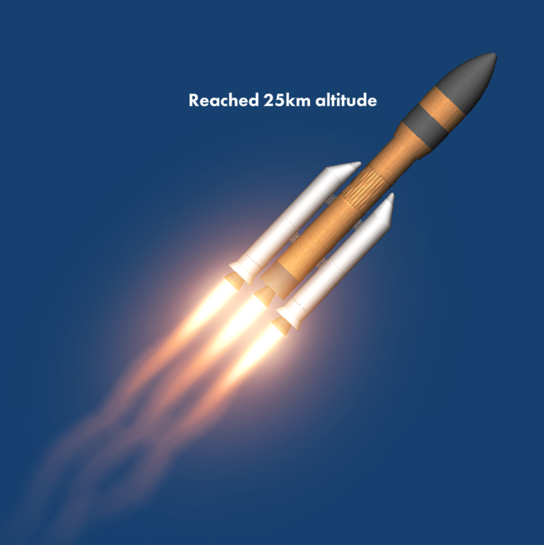
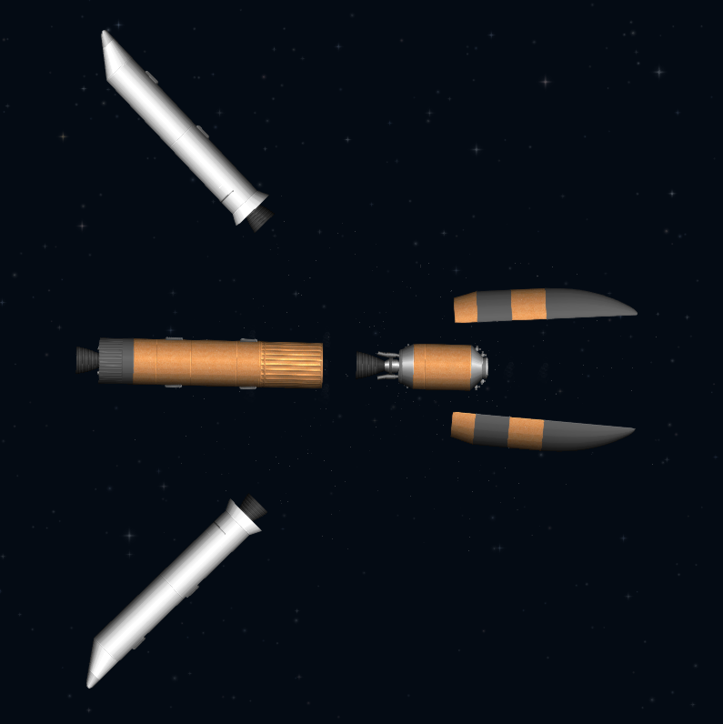
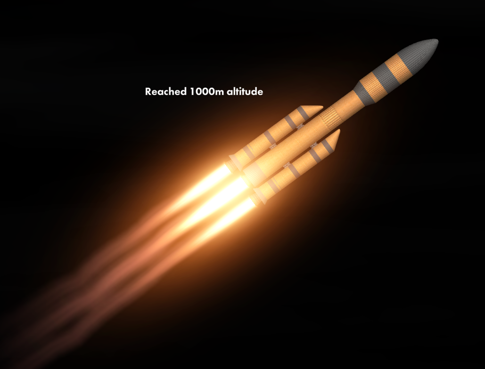

# Golden Heavy Block 1 & 2 `Retired`

Yep, this is Gray Heavy predecessor. I created it just after i bought Spaceflight Simulator expansion pack, ignore the fact that ~~i use titan engine for second stage~~. A very poorly made rocket, core stage will run out of fuel literally 5 seconds after booster sep.

### Block 1
- *Designed for Normal Mode*
- **Max Payload:** 122 Tons
- **Fairing Dimensions:** 5 x 14 Meters

###### Image:

### Block 2
- **Max Payload:** 275 Tons
- **Fairing Dimensions:** 5 x 17.5 Meters

###### Image:

###### Links:
Block 1 - https://sharing.spaceflightsimulator.app/rocket/VjztOuRJEe2dMLuAd13aUA

Block 2 - https://sharing.spaceflightsimulator.app/rocket/LDZxsORNEe2dMLuAd13aUA
