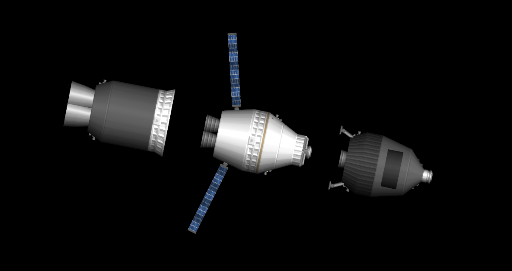

###### Links:
Block 1 - https://sharing.spaceflightsimulator.app/rocket/MFxiiORLEe2dMLuAd13aUA

Experimental Booster - https://sharing.spaceflightsimulator.app/rocket/qJ9wIOQjEe2dL7uAd13aUA

Moon Lander - https://sharing.spaceflightsimulator.app/rocket/Ovb22OQmEe2dMLuAd13aUA

# Gray Heavy Block 1 `Retired`

### Block 1
This one is my workhorse rocket, I've launched it at least 30 times or more. This boi has built 3 Space Stations and been to the moon before, that's why I put him on my profile picture (before changing it, lol).

- *Designed for Normal Mode*
- **Max Payload:** 130 Tons
- **Fairing Dimensions:** 5 x 15.5 Meters

###### Image:

### GL040223 `Retired`
My second attempt at making a partially reusable system using Gray Heavy core stage (While also launched SRC V1 to Gray Space Station and testing it before making V2 for moon mission), the plan was just to survive re-entry and try to land the booster, that's it! I wasn't thinking about reusing it at the time, that's when I finally wanted to create a system that was actually reusable.

- **Payload:** Space Rice Cooker V1

###### Image:

### Gray Heavy Block 1 -Moon Lander- `Retired`

- **Payload:** Space Rice Cooker V2 & Egg Lander V2

###### Image:

