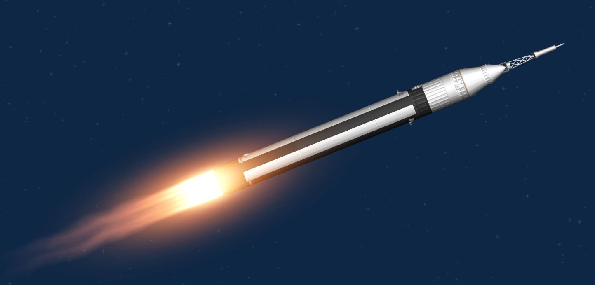
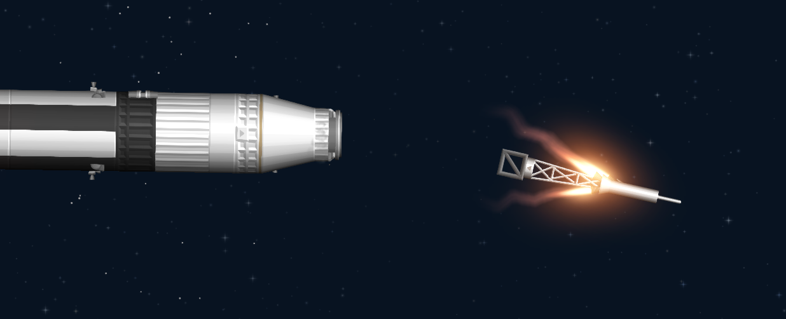
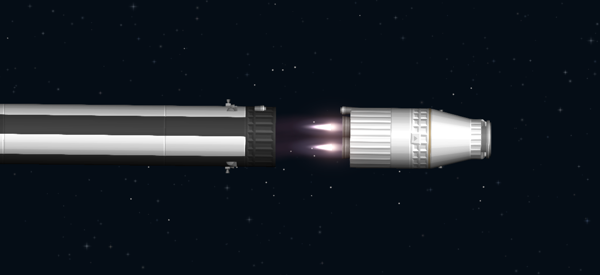
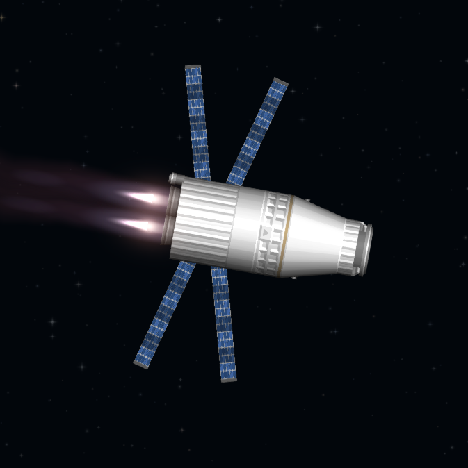
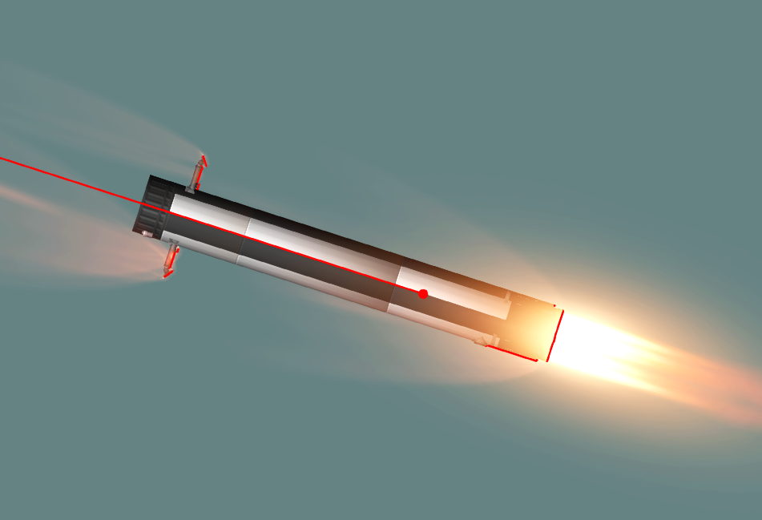
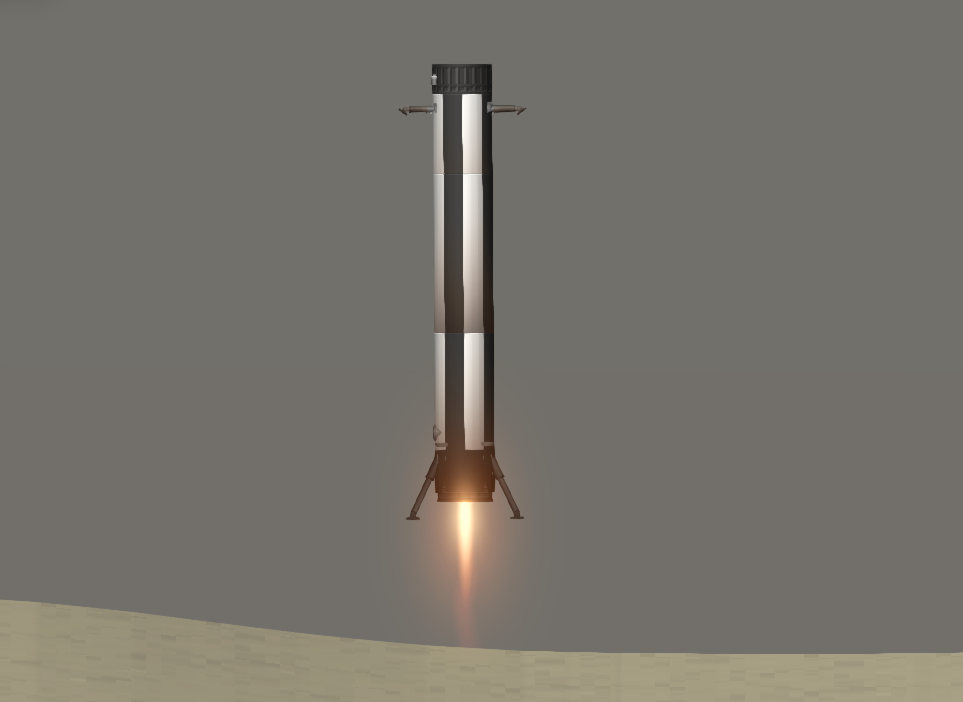
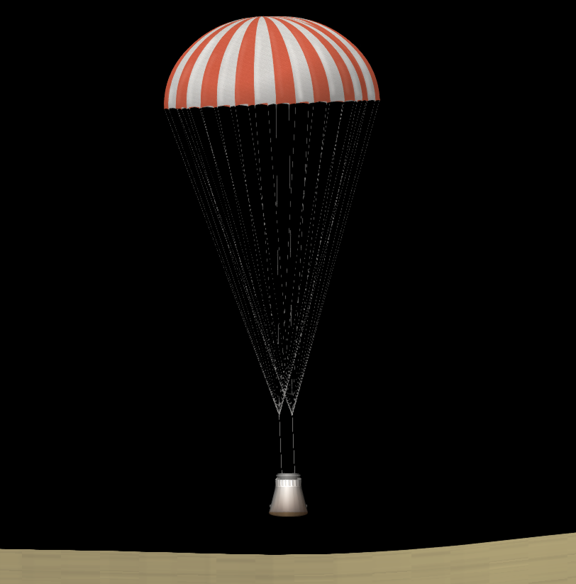

###### Links:
Saturn Crew - https://sharing.spaceflightsimulator.app/rocket/PMQDmuRREe2dMLuAd13aUA

Reco - https://sharing.spaceflightsimulator.app/rocket/8RrSNuRTEe2dMLuAd13aUA

# Saturn Crew `Retired`

After a ton of work and research on youtube, for the first time, i finally able to actually reuse a rocket booster, not just land it! Even though we need to do quicksaves edit to teleport the landed booster back to launch site... 

- *Designed for Normal Mode*

###### Image:

With that, i'm officially reused a rocket booster!
