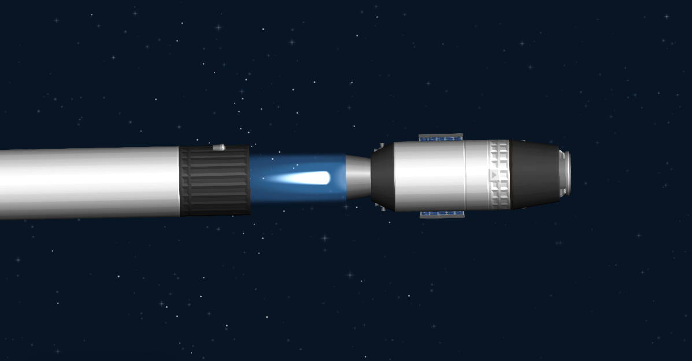

###### Links:
Nebulae - https://sharing.spaceflightsimulator.app/rocket/7sdcdeRUEe2dMLuAd13aUA

Reco - https://sharing.spaceflightsimulator.app/rocket/RbVy5uRVEe2dMLuAd13aUA

# Nebulae `Retired`

A slightly improved version of the Saturn Crew, can perform a Return To Launch Site maneuver, meaning you don't need to do any Quicksave edits! Unfortunately landing is more difficult, because it uses a single engine. Nebulae never appeared in any videos on my channel, too few changes were made. So I skipped to the Super Massive Project (Spoiler: it failed miserably)

- *Designed for Normal Mode*

###### Image:

One step closer to rapid reusability!
