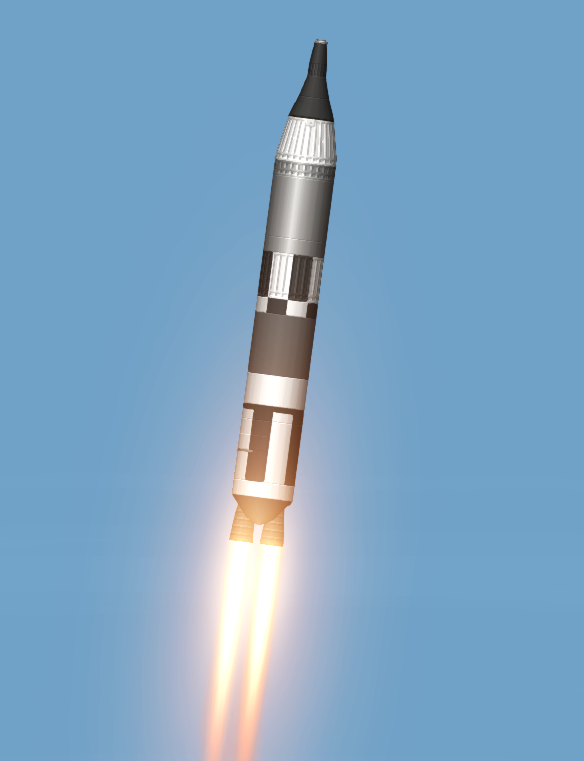
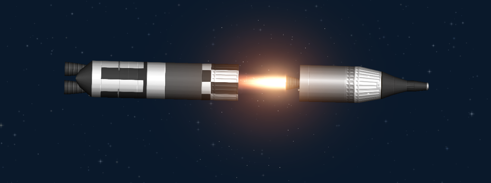
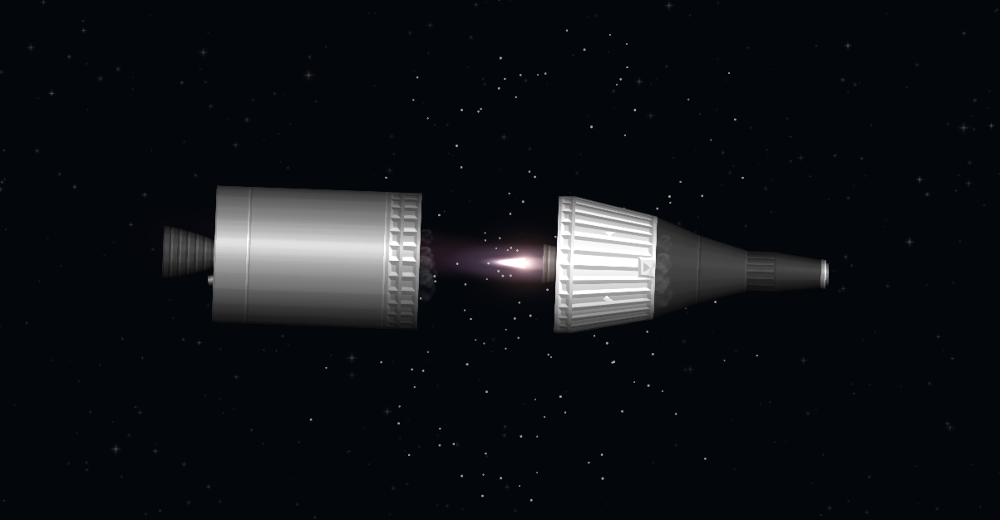
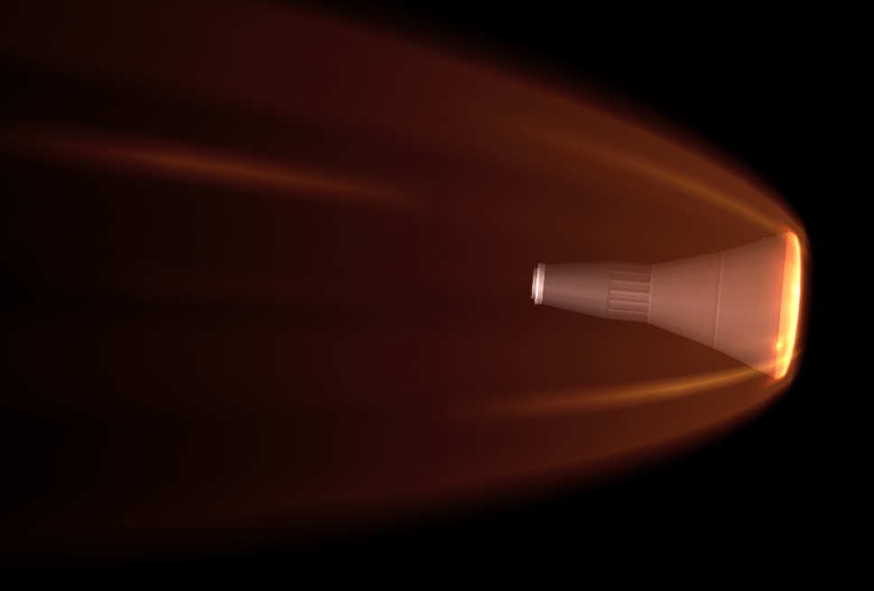
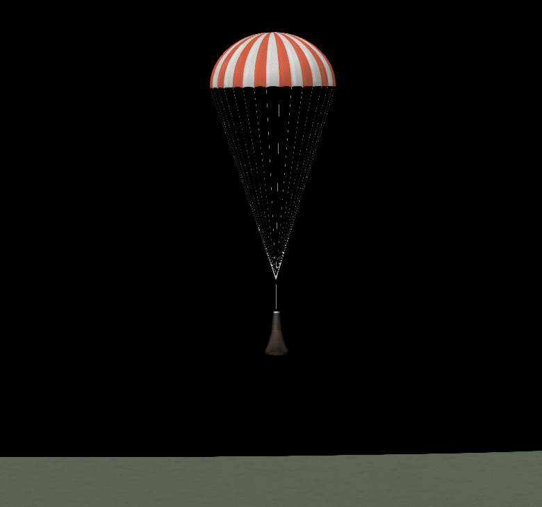

###### Links:
Titan II - https://sharing.spaceflightsimulator.app/rocket/rX7OyeRPEe2dMLuAd13aUA

# Titan II `Recreation`

Recreated for Gemini Program recreation video, just to be cancelled (Still have a probability to comeback, tho)

- *Originality Designed for Normal Mode, but works for Realistic Mode too*

###### Image:

Man, i hope this spacecraft don't go spinning uncontrolable!
